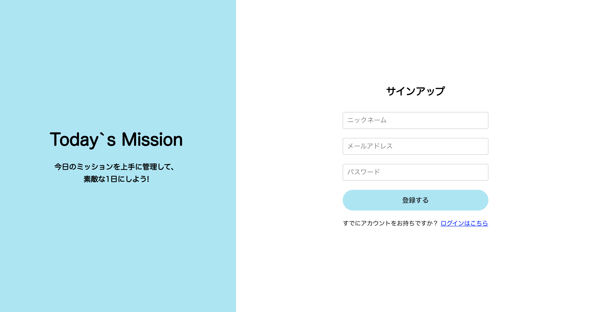
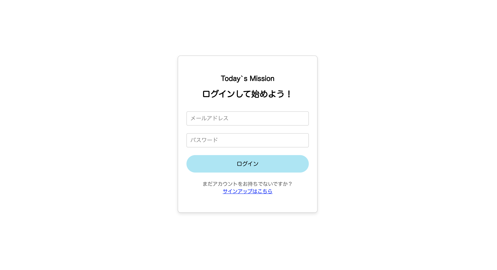
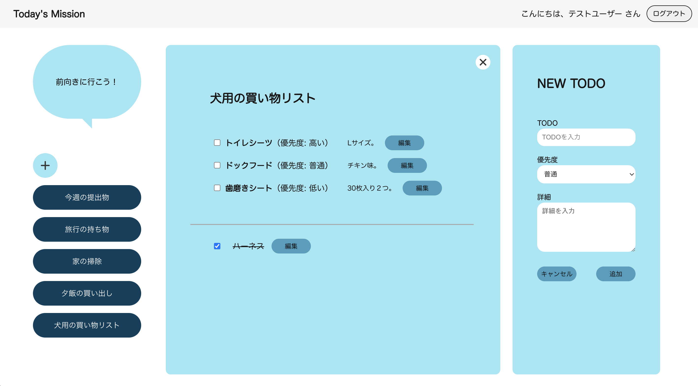

# Today's Mission

### 概要

**シンプルなWebベースのTODOアプリです。タスクの追加・編集・削除・完了状態の管理が可能、日々のタスク管理を効率化します。**

### 機能一覧

・サインアップ\
・ログイン、ログアウト\
・応援メッセージ表示\
・リストの新規作成、削除\
・リストタイトルの変更\
・リスト一覧の表示\
・TODOのアイテムの追加、編集、削除\
・優先度順でのアイテム表示

### スクリーンショット

### デモURL

https://today-s-mission.vercel.app/

### テストログイン情報

・メールアドレス : 123test@test.com\
・パスワード : 123test\
＊ログイン後のユーザー名は『テスト123』と表記されます。

### 使い方

①ログイン\
②左側の＋ボタンでリストの新規作成\
③NEW TODO’でTODOアイテムを追加

### 使用技術

・Next.js (App Router)\
・React\
・TypeScript\
・CSS Modules\
・Supabase（データベース + 認証）\
・Vercel（ホスティング）
